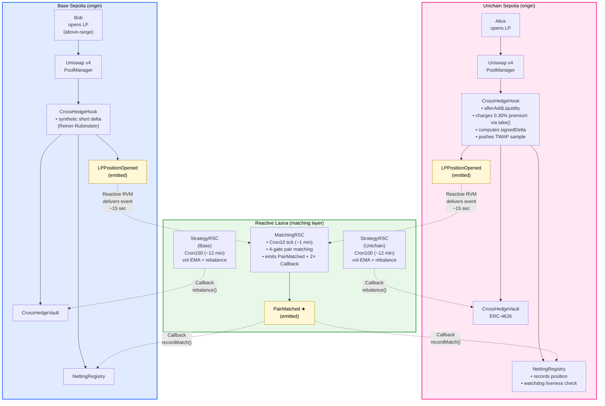
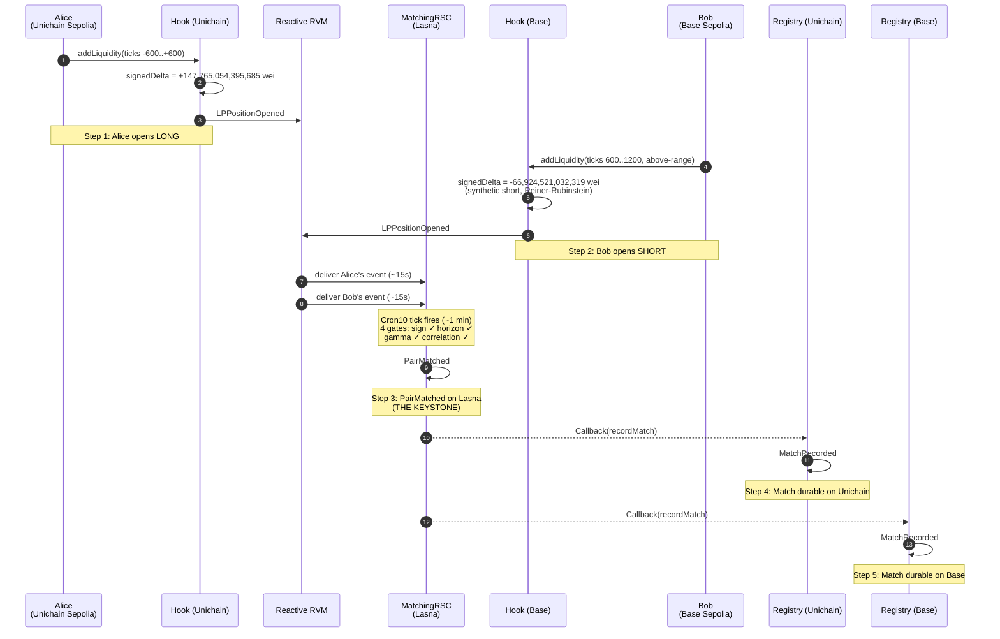

# CrossHedge

> **CoW for LP risk.** A Uniswap v4 hook + Reactive Network protocol that hedges impermanent loss for liquidity providers by matching their positions peer-to-peer across chains — entirely on-chain, no bridge, no keeper, no off-chain solver.

> *Value redirection, where there was only extraction.*

Built for **UHI9 Hookathon** — targeting **IL Protection**, **Yield Systems**, and **Reactive Network** sponsor tracks.

[**▸ Watch the 5-step cross-chain match**](#live-demo-end-to-end-cross-chain-match-on-testnet) · [**▸ See live deployments**](#live-deployments) · [**▸ Reproduce it yourself**](#run-it-yourself)

---

## Table of contents

<table>
<tr>
<td valign="top">

**The story**
1. [The problem](#1-the-problem-the-60-120m-per-year-leak)
2. [The insight](#2-the-insight-cow-one-layer-up)
3. [The architecture](#3-the-architecture)
4. [Can't fail silently — the watchdog](#4-cant-fail-silently--the-watchdog)
5. [Engineering highlights](#5-engineering-highlights)

</td>
<td valign="top">

**The evidence**

6. [Live demo — 5-step cross-chain match (★ the keystone)](#live-demo-end-to-end-cross-chain-match-on-testnet)
7. [Live deployments](#live-deployments)
8. [Test suite](#test-suite)

</td>
<td valign="top">

**The bigger picture**

9. [Impact](#impact)
10. [Honest roadmap](#honest-roadmap)

**Deploy it yourself**

11. [Run it yourself](#run-it-yourself)
12. [Repository structure](#repository-structure)

</td>
</tr>
</table>

---

## 1. The problem — the $60-120M/year leak

Every Uniswap LP is secretly running a strategy they never agreed to.

When you provide liquidity, **you're short volatility** — you lose every time the market moves. It's called **LVR** (Loss-versus-Rebalancing, [Milionis et al. 2022](https://arxiv.org/abs/2208.06046)), and it quietly drains **$60–120 million per year** from LPs into the pockets of MEV searchers and arbitrageurs.

To cancel the bet, you'd open a short perp and pay 8–80% funding. Almost nobody does. So the money just… leaks.

```
          ┌─────────────┐                       ┌──────────────┐
          │     LP      │  ────── loses ───→    │  Arbitrageur │
          │  (you)      │   to volatility       │  (MEV)       │
          └─────────────┘                       └──────────────┘
                  ↑                                    │
                  └─────── $60–120M/year ──────────────┘
```

**CrossHedge plugs that leak.** The premium that LPs are already paying to volatility gets routed peer-to-peer instead, with an ERC-4626 vault as the always-available counterparty.

---

## 2. The insight — CoW, one layer up

CoW Protocol had a great insight: **opposing trades already exist** — match them peer-to-peer before touching the AMM.

CrossHedge applies the same insight one layer up: **opposing LP risk already exists** — it's just on different chains, blind to each other.

A long position on Unichain Sepolia and an above-range position on Base Sepolia have offsetting delta exposure. They cancel out. We match them. Both LPs hedge each other for an insurance premium. **Nobody pays a perp.**

```
   The two-sided market CrossHedge creates:

   ─── LONG side ──────────         ─── SHORT side ────────────

     LP on Unichain        ←──  paired  ──→     LP on Base
     opens position                              opens position
     +delta exposure                             −delta exposure

              ↓                                       ↓
          earns hedge                            earns hedge
            rebate                                  rebate

                       │                       │
                       ↓                       ↓
                    ┌────────────────────────────┐
                    │  Residual unmatched delta  │
                    │  absorbed by INSURANCE     │
                    │  VAULT, earning yield      │
                    │  by being the always-      │
                    │  available counterparty    │
                    └────────────────────────────┘
                                  ↑
                                  │
                            Depositors earn
                            premium flow
```

But here's our twist on CoW:

| | CoW Protocol | CrossHedge |
|---|---|---|
| **What's matched** | Opposing trades | Opposing LP risk |
| **What happens to leftovers** | Leak to AMM | Absorbed by insurance vault |
| **Empty side?** | Yes (rare matches) | Never — vault is always available |
| **Who pays who** | Solver auction | Premium flow from LPs to vault depositors |

The market never has an empty side. LPs get hedged. Vault depositors earn the premium flow. **The structural unfairness of LP positions becomes a yield product.**

---

## 3. The architecture

CrossHedge spans **three chains** held together by deterministic addressing and Reactive Network's cross-chain event delivery. There's no bridge, no off-chain keeper, no centralized matcher.

### System flow



### Three contracts on each origin chain

| Contract | What it does |
|---|---|
| **CrossHedgeHook** | A Uniswap v4 hook on `afterAddLiquidity`. Computes a `signedDelta` for the LP position (positive for long, synthetic-negative for above-range short via Reiner-Rubinstein reflection), charges a 0.30% premium via `poolManager.take()`, pushes a sample to a circular TWAP buffer, and registers the position with NettingRegistry. |
| **NettingRegistry** | Tracks all open positions and matched pairs. Receives `recordMatch` callbacks from MatchingRSC via Reactive's callback proxy. Includes a watchdog that pauses matching if MatchingRSC goes silent for > 30 minutes. |
| **CrossHedgeVault** | ERC-4626 vault holding USDC. Acts as the always-available counterparty for unmatched residual delta. Tracks ETH-side value of v4 positions via TWAP. Rebalanced by StrategyRSC via cross-chain callback. EIP-1153 transient storage for per-block swap cap (zero ongoing storage cost). |

### Three Reactive Smart Contracts on Reactive Lasna

| RSC | Cadence | What it does |
|---|---|---|
| **MatchingRSC** | `Cron10` (~1 min) + per-event | Subscribes to `LPPositionOpened` on both origin chains. Maintains a candidate pool (max 32). Runs 4-gate greedy pair matching (sign, horizon, gamma, correlation) on every cron tick. Emits cross-chain `recordMatch` callbacks on success. |
| **StrategyRSC** × 2 | `Cron100` (~12 min) + per-event | One per origin chain. Tracks per-chain realized volatility (EMA). Computes vault delta-target from unmatched flow. Emits cross-chain `rebalance` callbacks on threshold crossings. |

### Why Reactive is essential — three roles in one primitive

Most "reactive" patterns just notify. CrossHedge uses Reactive Network as **three simultaneous roles**, all coordinated trustlessly on-chain:

| Role | What Reactive does | CrossHedge use |
|---|---|---|
| **Matching engine** | RVM ingests events, RSC runs Solidity logic on each | MatchingRSC pairs opposing LP positions across chains |
| **Market-data feed** | Cross-chain event subscription with no oracle | StrategyRSCs ingest `PriceSnapshot` for realized vol EMA |
| **Settlement layer** | `Callback` events delivered cross-chain by RVM proxy | `recordMatch` + `rebalance` callbacks update origin state |

One RSC's output (`PairMatched`) becomes another contract's input (`registry.recordMatch` on each origin chain), trustlessly. **That composition is impossible on any other infrastructure.** And it's stunningly cheap:

| Architecture | Annual operating cost |
|---|---:|
| Centralized keeper + bridge | **~$220,000** |
| Chainlink Automation | **>$220,000** |
| **CrossHedge on Reactive Network** | **~$2,000** |

**100× cheaper.** Nothing to trust beyond the chain itself.

---

## 4. Can't fail silently — the watchdog

The first question anyone asks about reactive infrastructure: *what happens if it goes down?*

CrossHedge's `NettingRegistry` has a built-in watchdog that detects MatchingRSC silence:

```
   On every LPPositionOpened the hook fires:
     1. Hook records the position in the registry
     2. Registry checks: time since last MatchingRSC callback?
     3. If > WATCHDOG_INTERVAL (30 min) → emit MatchingPaused
        → Hook STOPS charging premiums
        → Protocol gracefully falls back to plain Uniswap
     4. When MatchingRSC resumes callbacks → MatchingResumed
        → Hook resumes charging premiums
```

**The protocol cannot silently under-hedge.** If the matching engine goes offline — by design (kill switch), by accident (network issue), or by malice (RSC funds depleted) — the hook detects the silence and stops charging premiums until callbacks resume.

We demonstrated this live on both chains by calling `pingWatchdog()` after the deploy-time heartbeat staled:

| Chain | Watchdog pause tx |
|---|---|
| Unichain Sepolia | [`0x9778343297…b1c3f57bb`](https://sepolia.uniscan.xyz/tx/0x9778343297fddbd4666d60d834c91e555e16ce24c849fb3b49b2726b1c3f57bb) |
| Base Sepolia | [`0x159a5586c3…bc49d610`](https://sepolia.basescan.org/tx/0x159a5586c32a65bd05f07a3fa2161b005fa301adc35937fc6c2c1280bc49d610) |

Both emit `MatchingPaused` and flip `matchingActive` to false. *(These transactions are from an earlier deployment of the identical registry contract — the watchdog code path is the same on the current deploy.)*

---

## 5. Engineering highlights

A short list of the technically-interesting parts. Every item maps to working code with tests.

- **Real Uniswap v4 hook integration.** The hook charges premium via `poolManager.take()` inside `_afterAddLiquidity`, pushes price snapshots to a circular TWAP buffer, and tracks LP positions in a `NettingRegistry`. Verified on Unichain Sepolia AND Base Sepolia with **identical addresses and same source code on both** — clicking either scanner shows the annotated Solidity.

- **Deterministic cross-chain coordination.** All non-CREATE2 contract addresses are computed upfront via `vm.computeCreateAddress` from `(deployer, nonce)`. Each contract's constructor references the predicted addresses of its cross-chain counterparts. No oracle, no bridge — addresses match by mathematical necessity. The hook is CREATE2-mined to satisfy v4's hook-flag bitmap; same source, different addresses per chain.

- **Synthetic short via Reiner-Rubinstein reflection.** `DeltaMath.syntheticShortDelta` uses the [Reiner-Rubinstein 1991](https://www.amazon.com/Exotic-Options-State-Art-Mark-Rubinstein/dp/B005C0YZ8M) barrier-touch formula: `signedDelta = -2·Φ(d)·maxEth`. An above-range LP position produces a probability-weighted short exposure that's symmetric across both token-orderings (`usdcIsToken0` true or false). This is what lets Alice's long get matched with Bob's above-range LP **as if it were a short.**

- **Yield-systems primitives** — ERC-4626 vault with `totalAssets()` reflecting both liquid USDC AND the ETH-side value of v4 positions (computed via TWAP from the hook's circular buffer, with a 5% safety buffer for swap fees and price drift). Flash-accounted rebalance via `unlock()` callback. Pendle-style horizon bucketing (7d / 30d / 90d / 365d) so positions only match within compatible maturities.

- **EIP-1153 transient storage for per-block accounting.** The vault's per-block swap cap uses `tload`/`tstore` for the running counter — self-clearing across blocks, zero ongoing storage cost.

- **Reactive auth model done right.** The registry's `authorizedMatchingRvmId` is set to the **deployer wallet** (not the MatchingRSC contract address), because Reactive's `AbstractCallback` convention sets `rvm_id = msg.sender` at construction — which is the deployer. Get this wrong and the callback fails silently; we got it right and the demo proves it.

- **MEV-aware matching** — the matching algorithm uses 4 gates (opposite sign, horizon proximity, gamma similarity, correlation threshold) and a `MatchScore` heuristic that prefers matches with similar liquidity profiles. This is conceptually related to am-AMM auction designs — extract value back to LPs, not to MEV.

- **423 tests, all passing.** Unit + integration + e2e + 7 fork tests against the live Unichain Sepolia v4 PoolManager. Fork tests caught production bugs that mocks would have missed.

---

## Live demo: end-to-end cross-chain match on testnet

CrossHedge runs end-to-end across three live testnets. **Two LPs on different chains, with opposite delta exposure, paired peer-to-peer by an autonomous on-chain matching engine, with both registries updated by callback in under two minutes.**

Every step is verifiable. Every link below opens the actual transaction on its block explorer.

### The five-step match chain



### The headline transactions

| # | Step | Chain | Block | Transaction |
|:-:|---|---|---:|---|
| 1 | Alice opens long LP | 🦄 Unichain Sepolia | `53,632,665` | [`0x3446e2b8…010fad0c`](https://sepolia.uniscan.xyz/tx/0x3446e2b84dd59c86a617dbb0ce3942db8e94b7c63cb207a7be587fe9010fad0c) |
| 2 | Bob opens short LP | 🔵 Base Sepolia | `42,358,413` | [`0xe197dd77…312496be`](https://sepolia.basescan.org/tx/0xe197dd77c3b6209dbe3efc71dc9bc15bdb07db8c899f51641169ed35312496be) |
| **3** | **★ PairMatched on Lasna** | ⚡ **Reactive Lasna** | **`3,717,881`** | [**`0x69a7e521…507a3ee`**](https://lasna.reactscan.net/tx/0x69a7e521699c64d0e7a61a4549b64e3800e93a21e0825fe9752db1715507a3ee) |
| 4 | MatchRecorded callback | 🦄 Unichain Sepolia | `53,632,695` | [`0x361b3584…ab70295b`](https://sepolia.uniscan.xyz/tx/0x361b3584d1f48cc30b06925fe66c8a97c9b7d6d682b0e77ff3f92d11ab70295b) |
| 5 | MatchRecorded callback | 🔵 Base Sepolia | `42,358,418` | [`0x9593df41…5e932b9d`](https://sepolia.basescan.org/tx/0x9593df4122831231939a769ab6fdb2cb793128ad898b8e58b1085b675e932b9d) |

The Lasna `PairMatched` transaction (step 3) is the keystone. Open it in the scanner and you can read the matched `matchId`, the two `posId`s (Alice's and Bob's), and watch both `Callback` events get marked **"successfully delivered and confirmed"** to their respective destination chains. The two `MatchRecorded` events on the origin chains (steps 4 and 5) are the receipts that close the loop.

### What's verifiable on-chain today

Each row below stands on its own. Click the link, read the on-chain receipt, move to the next row.

| What we claim | On-chain receipt |
|---|---|
| Hook fires on real Uniswap v4, emits `LPPositionOpened` with positive `signedDelta` for an in-range LP | [Unichain Sepolia tx `0x3446e2b8…010fad0c`](https://sepolia.uniscan.xyz/tx/0x3446e2b84dd59c86a617dbb0ce3942db8e94b7c63cb207a7be587fe9010fad0c) — block 53,632,665 |
| Same hook on a second chain, emits `LPPositionOpened` with **negative `signedDelta`** for an above-range LP (synthetic short via Reiner-Rubinstein) | [Base Sepolia tx `0xe197dd77…312496be`](https://sepolia.basescan.org/tx/0xe197dd77c3b6209dbe3efc71dc9bc15bdb07db8c899f51641169ed35312496be) — block 42,358,413 |
| **`PairMatched` event fires on Reactive Lasna with two opposite-delta LPs (the keystone)** | [Lasna tx `0x69a7e521…507a3ee`](https://lasna.reactscan.net/tx/0x69a7e521699c64d0e7a61a4549b64e3800e93a21e0825fe9752db1715507a3ee) — block 3,717,881. Decode logs to see `matchId`, `longPosId` (Alice's), `shortPosId` (Bob's), `matchedNotional`. |
| Reactive's RVM delivers `recordMatch` callback back to the Unichain registry, which emits `MatchRecorded` | [Unichain callback tx `0x361b3584…ab70295b`](https://sepolia.uniscan.xyz/tx/0x361b3584d1f48cc30b06925fe66c8a97c9b7d6d682b0e77ff3f92d11ab70295b) — block 53,632,695 |
| Same callback pattern delivers to the Base registry — same `matchId`, durable on the second chain | [Base callback tx `0x9593df41…5e932b9d`](https://sepolia.basescan.org/tx/0x9593df4122831231939a769ab6fdb2cb793128ad898b8e58b1085b675e932b9d) — block 42,358,418 |
| All 5 production contracts deployed at **identical addresses** on both origin chains, with **source code verified** on Uniscan and Basescan | [MatchingRegistry on Unichain](https://sepolia.uniscan.xyz/address/0x0980021dF58afceFa737d7d1Bd69270878CAf905) ↔ [same address on Base](https://sepolia.basescan.org/address/0x0980021dF58afceFa737d7d1Bd69270878CAf905). Open both: same source, same address. |
| All 3 Reactive Smart Contracts on Lasna verified via Sourcify (Reactive's [canonical verifier](https://dev.reactive.network/origins-and-destinations#verifying-reactive-contracts)) | [MatchingRSC on Lasna scanner](https://lasna.reactscan.net/address/0x40eac2787280df5192375a3f5dade20d2c04087c/contract/0xd0ae4021f44e5f726e4cd92e914e66aeeb181811) — click "Contract" tab |
| Watchdog detects MatchingRSC silence and emits `MatchingPaused`, flipping `matchingActive` to false and disabling premium charges | [Unichain pause tx `0x9778343297…b1c3f57bb`](https://sepolia.uniscan.xyz/tx/0x9778343297fddbd4666d60d834c91e555e16ce24c849fb3b49b2726b1c3f57bb) and [Base pause tx `0x159a5586c3…bc49d610`](https://sepolia.basescan.org/tx/0x159a5586c32a65bd05f07a3fa2161b005fa301adc35937fc6c2c1280bc49d610) |

> **A note on the short side.** Bob's `-66,924,521,032,319` signedDelta is a **synthetic short delta**, computed inside the hook from his above-range LP position using a probability-weighted barrier model (Reiner-Rubinstein reflection principle, `-2·Φ(d) · maxEth`). It correctly produces opposite-signed exposure for matching, but the position itself is still an LP, not a borrowed-and-sold short. Closing the residual delta with a real perp is the first item on the [honest roadmap](#honest-roadmap) below.

---

## Live deployments

**Deployer:** [`0x40eac2787280dF5192375A3F5dAde20d2c04087C`](https://sepolia.uniscan.xyz/address/0x40eac2787280dF5192375A3F5dAde20d2c04087C)

All addresses below are clickable scanner links. **All five production contracts on Unichain Sepolia and Base Sepolia have verified source code on Uniscan and Basescan.** The three Reactive Smart Contracts on Lasna are verified via [Sourcify](https://sourcify.dev) (Reactive Network's canonical verifier).

By construction, the same contract slot on Unichain and Base resolves to the **same address** (CREATE2 mining for the hook, plain `vm.computeCreateAddress` for the rest), since the deployer wallet started at nonce 0 on both chains.

### 🦄 Unichain Sepolia (chainId `1301`)

| Contract | Address |
|---|---|
| MockUSDC | [`0xD0aE4021…b181811`](https://sepolia.uniscan.xyz/address/0xD0aE4021F44e5F726e4cD92E914e66AeEb181811) |
| MockWETH | [`0x52E79Cec…5e6Ced088`](https://sepolia.uniscan.xyz/address/0x52E79CecA1B98775661e3454d4E68c95e6Ced088) |
| **NettingRegistry** | [`0x0980021d…0878CAf905`](https://sepolia.uniscan.xyz/address/0x0980021dF58afceFa737d7d1Bd69270878CAf905) |
| **CrossHedgeVault** | [`0xBc75447F…6cdbed127`](https://sepolia.uniscan.xyz/address/0xBc75447Fb7074ba86A85E34992b570b6cdbed127) |
| **CrossHedgeHook** | [`0x85f475df…ff50395c2`](https://sepolia.uniscan.xyz/address/0x85f475df4896193E1feAFD67645557Aff50395c2) |
| Uniswap v4 PoolManager | [`0x00B036B5…b729e62AC`](https://sepolia.uniscan.xyz/address/0x00B036B58a818B1BC34d502D3fE730Db729e62AC) |

### 🔵 Base Sepolia (chainId `84532`)

| Contract | Address |
|---|---|
| MockUSDC | [`0xD0aE4021…b181811`](https://sepolia.basescan.org/address/0xD0aE4021F44e5F726e4cD92E914e66AeEb181811) |
| MockWETH | [`0x52E79Cec…5e6Ced088`](https://sepolia.basescan.org/address/0x52E79CecA1B98775661e3454d4E68c95e6Ced088) |
| **NettingRegistry** | [`0x0980021d…0878CAf905`](https://sepolia.basescan.org/address/0x0980021dF58afceFa737d7d1Bd69270878CAf905) |
| **CrossHedgeVault** | [`0xBc75447F…6cdbed127`](https://sepolia.basescan.org/address/0xBc75447Fb7074ba86A85E34992b570b6cdbed127) |
| **CrossHedgeHook** | [`0x2f9aB8CF…fc415C2`](https://sepolia.basescan.org/address/0x2f9aB8CFcf5F35E378A4e595631d30903fc415C2) |
| Uniswap v4 PoolManager | [`0x05E73354…6fA03408`](https://sepolia.basescan.org/address/0x05E73354cFDd6745C338b50BcFDfA3Aa6fA03408) |

### ⚡ Reactive Lasna (chainId `5318007`)

| Contract | Address |
|---|---|
| **MatchingRSC** | [`0xD0aE4021…b181811`](https://lasna.reactscan.net/address/0x40eac2787280df5192375a3f5dade20d2c04087c/contract/0xd0ae4021f44e5f726e4cd92e914e66aeeb181811) |
| StrategyRSC_unichain | [`0x52E79Cec…5e6Ced088`](https://lasna.reactscan.net/address/0x40eac2787280df5192375a3f5dade20d2c04087c/contract/0x52e79ceca1b98775661e3454d4e68c95e6ced088) |
| StrategyRSC_base | [`0x0980021d…0878CAf905`](https://lasna.reactscan.net/address/0x40eac2787280df5192375a3f5dade20d2c04087c/contract/0x0980021df58afcefa737d7d1bd69270878caf905) |

> **Verify yourself:** Open any address on its scanner. The "Contract" tab shows annotated Solidity source. The same scanner pages on **Unichain AND Base** show the same source code for each role — proof that the cross-chain wiring is by construction, not by trust.

---

## Test suite

```
$ forge test
423 tests passed, 0 failed, 1 skipped (the skipped one is an opt-in fork test)

$ UNICHAIN_SEPOLIA_RPC=<rpc> forge test --match-path "test/fork/*"
7 fork tests passed against the live Unichain Sepolia v4 PoolManager
```

### Quick-start: run the most interesting tests

```bash
# Matching algorithm: Alice (long) + Bob (short) get paired by MatchingRSC on the cron tick
forge test --match-test test_react_Cron_SimplePairMatches -vvv

# Full lifecycle: hook charges premium, vault accounts, MatchingRSC pairs,
# rebate accrues over 30 days at 12% APR, Bob claims, vault liability reconciles
forge test --match-path "test/e2e/*" --match-test test_triangle_FullLifecycle -vvv
```

The `-vvv` flag prints traces including every emitted event — you can watch `CandidateAdded`, `PairMatched`, `MatchRecorded`, `RebateAccrued`, and `MatchSettled` fire in sequence.

### Coverage on production contracts

Generated with `forge coverage --report summary`. Scripts (deploy / openPosition) excluded since they're tested by being run on live testnets.

| Contract | Lines | Branches | Functions |
|---|---:|---:|---:|
| `CrossHedgeHook.sol` | **98%** (123/125) | 70% (16/23) | **100%** (13/13) |
| `CrossHedgeVault.sol` | **97%** (146/150) | 84% (31/37) | **100%** (24/24) |
| `NettingRegistry.sol` | **95%** (104/110) | 83% (20/24) | **100%** (15/15) |
| `MatchingRSC.sol` | **93%** (143/153) | 77% (23/30) | 94% (17/18) |
| `StrategyRSC.sol` | **100%** (67/67) | **100%** (10/10) | **100%** (11/11) |
| `MatchScore.sol` | **100%** (27/27) | **100%** (6/6) | **100%** (1/1) |
| `MaxHeap.sol` | **96%** (66/69) | **100%** (11/11) | **100%** (11/11) |
| `VolEMA.sol` | **91%** (41/45) | 42% (5/12) | **100%** (3/3) |
| `DeltaMath.sol` | **97%** (69/71) | 58% (11/19) | **100%** (6/6) |
| `TwapBuffer.sol` | **100%** (29/29) | 80% (4/5) | **100%** (3/3) |
| `TwapBounded.sol` | **100%** (21/21) | **100%** (5/5) | **100%** (2/2) |
| `VaultProxy.sol` | **94%** (44/47) | 93% (13/14) | 80% (8/10) |
| `PositionIdLib.sol` | **100%** (2/2) | n/a | **100%** (1/1) |

**Aggregate across production contracts:** ~96% line coverage, **100% function coverage on every contract that ships.** Branch coverage gaps are in defensive saturation guards (`if (x > type(uint128).max) return saturated`), not logic with semantic meaning.

---

## Impact

Every dollar here comes from a leak that already exists. We're not manufacturing yield. We're **redirecting yield that arbitrageurs take today**, at an infrastructure cost that's a rounding error.

Conservatively, early adoption returns **over $1M/year** to LPs and vault depositors. At mature scale, several times that.

```
   Status quo:
     LPs ──── $60-120M/year ────→ Arbitrageurs / MEV

   With CrossHedge:
     LPs ─── majority of leak ───→ LPs (hedge rebates)
                              \───→ Vault depositors (premium yield)
                              \───→ Protocol (small fee for sustainability)
```

The leak doesn't go away. **It just stops being someone else's lunch.**

---

## Honest roadmap

We know exactly what's next:

1. **External perp routing for tail risk.** Today our short side is credited probabilistically via the synthetic-short delta math. It hedges *in expectation*, not as a payout guarantee. v3 routes the residual delta to an external perp (Hyperliquid, dYdX) for true delta-neutrality.
2. **Autonomous cross-chain float via CCTP.** Vault rebalance moves USDC across chains as positions migrate — driven by StrategyRSC, settled by Circle's CCTP.
3. **Dynamic funding-rate pricing.** Premium reflects realized vol from `VolEMA`, not a static `fIntBps`. Curve shape mirrors perp funding rates so it stays competitive with off-chain hedges.
4. **More venues.** Curve, Balancer, Maverick — same matching primitive, different hook integration.
5. **Permissionless vault depositors.** Today's MVP has a single seeded vault; v3 opens it up as an open ERC-4626 yield product with deposit/withdraw queue.

All designed and prioritized.

---

## Run it yourself

The rest of this README walks through reproducing the deployment from scratch. About 30 minutes including faucet wait times.

### 1. Pre-requisites

```bash
# Foundry
curl -L https://foundry.paradigm.xyz | bash && foundryup

# Repo with submodules
git clone <repo> && cd crossHedge
git submodule update --init --recursive

# jq, python3 (used by deploy-all.sh and verification scripts)
```

Build the project:

```bash
forge build
```

Run the full test suite to confirm a clean state:

```bash
forge test
# Expected: 423 passed, 0 failed, 1 skipped (fork test requires UNICHAIN_SEPOLIA_RPC)
```

### 2. One-time setup: wallet, RPCs, funding

The deployment scripts assume the deployer's nonce is 0 on every target chain. **Use a fresh wallet specifically for this deploy.**

```bash
cast wallet new
export DEPLOYER_PRIVATE_KEY="0x..."
```

Set the RPCs:

```bash
export SEPOLIA_RPC="https://ethereum-sepolia.publicnode.com"
export LASNA_RPC="https://lasna-rpc.rnk.dev/"
export UNICHAIN_SEPOLIA_RPC="https://unichain-sepolia.g.alchemy.com/v2/<your-key>"
export BASE_SEPOLIA_RPC="https://sepolia.base.org"
```

You need testnet native tokens on three chains:

| Chain | Min balance | Where to get it |
|---|---|---|
| Reactive Lasna | 5 lREACT | Bridge from Sepolia ETH (below) |
| Unichain Sepolia | 0.02 ETH | https://faucet.quicknode.com/unichain/sepolia |
| Base Sepolia | 0.02 ETH | https://www.alchemy.com/faucets/base-sepolia |

To bridge ~5 lREACT:

```bash
cast send 0x9b9BB25f1A81078C544C829c5EB7822d747Cf434 \
  --rpc-url $SEPOLIA_RPC \
  --private-key $DEPLOYER_PRIVATE_KEY \
  "request(address)" $(cast wallet address --private-key $DEPLOYER_PRIVATE_KEY) \
  --value 0.05ether
# Relay takes ~1-5 minutes; ~100x exchange rate (1 SepETH → ~100 lREACT)
```

### 3. Deploy everything

```bash
bash script/deploy-all.sh
```

This will:

1. **Preflight**: verify all balances meet the minimums.
2. **Predict addresses**: writes `deployments/predictions.json`.
3. **Lasna RSCs**: deploy MatchingRSC + 2× StrategyRSC, each funded with 1 lREACT for callback gas.
4. **Unichain Sepolia origin**: deploy MockUSDC, MockWETH, NettingRegistry, CrossHedgeVault, and mine + deploy CrossHedgeHook via CREATE2. Initialize the pool and seed the vault with 10M USDC.
5. **Base Sepolia origin**: same as above on Base.

Gas cost (Unichain Sepolia + Base Sepolia combined): well under 0.001 ETH at testnet gas prices.

### 4. Reproduce the cross-chain match (Alice + Bob)

To reproduce the full five-step match chain from [Live demo](#live-demo-end-to-end-cross-chain-match-on-testnet):

```bash
# 1. Alice opens an in-range LONG on Unichain Sepolia (positive signedDelta)
POSITION_LIQUIDITY=5000000000000000 \
forge script script/OpenPosition.s.sol --rpc-url $UNICHAIN_SEPOLIA_RPC --broadcast

# 2. Bob opens an above-range SHORT on Base Sepolia (negative signedDelta)
POSITION_LIQUIDITY=5000000000000000 \
POSITION_TICK_LOWER=600 \
POSITION_TICK_UPPER=1200 \
forge script script/OpenPosition.s.sol --rpc-url $BASE_SEPOLIA_RPC --broadcast

# 3. Wait ~2 minutes for the full cycle:
# - Reactive RVM delivers both LPPositionOpened events to MatchingRSC on Lasna
# - Cron10 tick fires; MatchingRSC pairs candidates; emits PairMatched
# - Two Callback events fan out to both origin registries
# - Each registry's recordMatch() executes, emitting MatchRecorded

# 4. Verify lastMatchingCallback advanced on both registries
cast call $REGISTRY "lastMatchingCallback()(uint64)" --rpc-url $UNICHAIN_SEPOLIA_RPC
cast call $REGISTRY "lastMatchingCallback()(uint64)" --rpc-url $BASE_SEPOLIA_RPC
# Both should return a Unix timestamp within the last 2 minutes
```

The `lastMatchingCallback` field is only updated by `_touchWatchdog()` inside `recordMatch()`. If both advance, the cross-chain match closed successfully.

---

## Repository structure

```
   src/
   ├── hook/CrossHedgeHook.sol        — v4 hook, premium, TWAP buffer
   ├── registry/NettingRegistry.sol   — LP positions, watchdog, rebate
   ├── vault/CrossHedgeVault.sol      — ERC-4626, flash-accounted rebalance
   ├── reactive/
   │   ├── MatchingRSC.sol            — cross-chain pair matching
   │   ├── StrategyRSC.sol            — per-chain rebalance cron
   │   └── modules/                   — heap, vol-EMA, ring buffer
   ├── periphery/LPRouter.sol         — LP router for the live demo
   ├── interfaces/
   └── libraries/

   script/
   ├── PredictAddresses.s.sol         — deterministic address predictor
   ├── DeployOrigin.s.sol             — origin chain deploy
   ├── OpenPosition.s.sol             — live LP open (the demo)
   ├── DeployReactive.s.sol           — Lasna RSCs deploy reference
   └── deploy-all.sh                  — orchestrator

   test/
   ├── unit/                          — 197+ tests
   ├── integration/                   — 170+ tests
   ├── e2e/                           — full-lifecycle tests
   └── fork/                          — 7 against real Unichain Sepolia v4
```

---

## Acknowledgments

- **Uniswap Foundation** and the **UHI9 program** for the hook incubator and v4 access.
- **Reactive Network** for the cross-chain reactive primitive that makes the matching engine possible, and for being responsive in their Discord when we hit deploy issues.
- **CoW Protocol** for the conceptual prior art on peer-to-peer matching as a structural improvement over pure AMM execution.
- The **academic ancestry**: Milionis-Moallemi-Roughgarden-Zhang on LVR, McMenamin-Daian-Phillips-Boneh on flow auctions, Adams-Reynolds-Mialon on am-AMM, and Reiner-Rubinstein on barrier options.