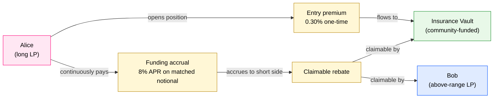
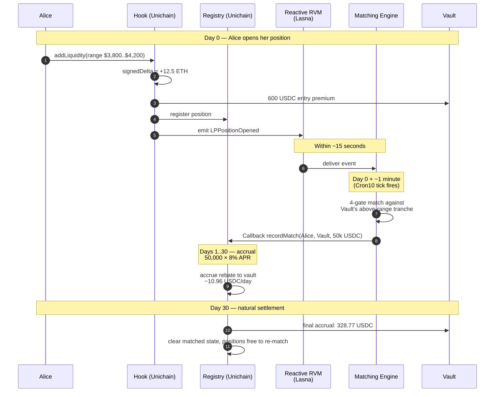
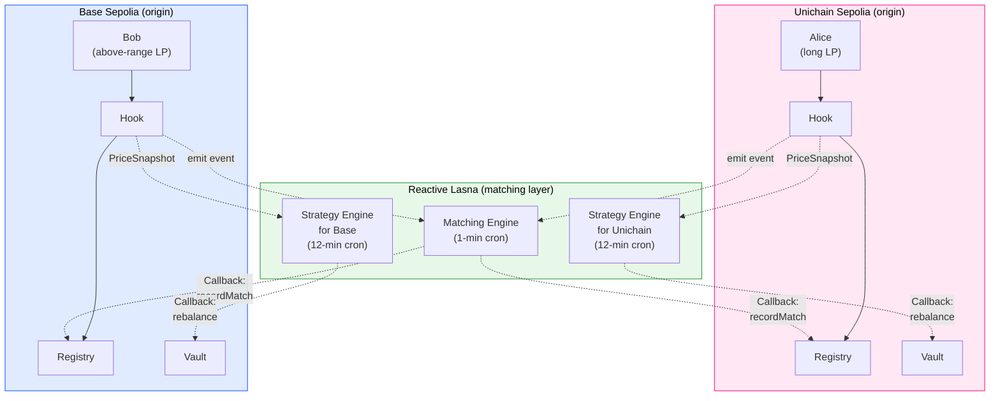

# CrossHedge

## The Whitepaper

### A protocol that lets liquidity providers earn fees without bleeding to impermanent loss, by matching them with people who want the opposite exposure, and using a community-funded vault as the always-available counterparty.

---

## How to read this document

This whitepaper assumes you are smart but unfamiliar with the protocol. It does not assume you have read the engineering documents. It does not assume you are a quant. Every technical concept is introduced with a plain-language explanation first, and the math is shown afterward with worked examples.

The document has seven parts:

1. **The Problem** — what liquidity providers actually do, why they lose money, and why nobody has fixed it.
2. **The Insight** — the simple observation that opposite intent already exists in the market, just disconnected.
3. **The Mechanism** — how matching, cancellation, premium flow, and the vault actually work.
4. **The Math** — every formula in the protocol, explained intuitively before symbolically.
5. **Walked-Through Scenarios** — four characters going through the protocol end to end.
6. **Architecture** — why this requires cross-chain coordination and Reactive Network specifically.
7. **Honest Limitations** — what the protocol does not do, and what comes in version two.

You can read straight through, or jump to whichever part answers your question. Each part is self-contained.

> If you read only one section: read **Part II — The Insight**. It is the entire pitch in three pages.
>
> If you are reading for the live demo: the README has the five clickable on-chain transactions that prove the matching engine works end-to-end on testnet today. This whitepaper explains *why* those transactions exist.

---

# Part I: The Problem

## I.1 What a liquidity provider actually does

When someone says "I'm an LP on Uniswap," here is what is actually happening.

The LP deposits two assets — say, USD Coin (a digital dollar, called USDC) and Ether (ETH) — into a pool. The pool sits in the middle of a market. Anyone who wants to trade ETH for USDC, or USDC for ETH, takes the other side of the LP's deposit. The LP receives a small fee on every trade — typically 0.05% to 0.30% of the trade size.

So far, this sounds like a passive income stream. Deposit assets, earn fees. But there is a catch that nobody mentions until you have already deposited.

## I.2 The catch — impermanent loss

The pool does not let the LP control the ratio of USDC to ETH they hold. As ETH's price moves, the pool automatically adjusts the ratio to keep the market balanced.

If ETH rises in price:

- The pool has been *selling* ETH for USDC as traders buy ETH from it.
- The LP ends up with less ETH and more USDC than they started with.
- If the LP had simply held the original ETH and USDC in their wallet, they would be wealthier than they are now in the pool.

The difference between "what the LP would have if they had just held" and "what the LP actually has in the pool" is called **impermanent loss**. It is called "impermanent" because if the price returns to where it started, the loss disappears. But in practice, prices rarely return to exactly where they started, and the loss becomes permanent.

A concrete example:

Alice deposits 25 ETH and 100,000 USDC into a pool when ETH is at 4,000 USDC per ETH. Her total starting value is 25 × 4,000 + 100,000 = 200,000 USDC.

ETH rises to 5,000 USDC. The pool rebalances. Alice now holds approximately 22.36 ETH and 111,803 USDC. Her position is worth 22.36 × 5,000 + 111,803 = 223,610 USDC.

But if Alice had simply held the original 25 ETH and 100,000 USDC, she would have 25 × 5,000 + 100,000 = 225,000 USDC.

Alice's impermanent loss is 225,000 − 223,610 = 1,390 USDC, or about 0.62% of her position.

She did earn fees from trades along the way. If those fees totaled, say, 600 USDC, her net loss after fees is about 790 USDC. She lost money by providing liquidity, even though she earned fees doing so.

## I.3 Why this is not random — Loss-Versus-Rebalancing

Academic researchers have given Alice's experience a precise name: **Loss-Versus-Rebalancing**, or LVR for short. It captures the fact that an LP is, in effect, always trading at slightly worse prices than the market currently offers — because the pool's price lags the true market price during volatile moves. Arbitrageurs (sophisticated traders) profit from that lag, and the profit comes directly from the LP's deposit.

A 2022 paper by Milionis, Moallemi, Roughgarden, and Zhang estimated this drain at 3 to 10 basis points per day on volatile pairs. Across all Uniswap version 3 pools, that adds up to between 60 million and 120 million US dollars per year flowing from passive LPs to arbitrageurs.

It is not random misfortune. It is a structural, predictable transfer of wealth from passive liquidity providers to professional traders.

## I.4 Why hedging is hard

The natural response is: "if LPs are losing money to price volatility, why don't they hedge?"

In theory, they could open a short position on a perpetual futures exchange. If ETH falls, the short position gains money, offsetting some of the LP's loss. If ETH rises, the short loses money, but the LP gains from holding ETH appreciation in the pool.

In practice, this is too painful for most LPs:

- **It costs money.** Perpetual short positions charge a funding rate, typically 8% to 12% annualized in normal markets and up to 40% to 80% during bull markets. That funding rate often exceeds the fee income from the pool.
- **It requires capital.** The LP must post collateral for the short, separate from the capital already in the pool.
- **It requires active management.** Position sizes must be rebalanced as the LP's exposure changes (which it does, every time the price moves).
- **It is on a different platform.** The LP must trust both the AMM (Uniswap) and the perp venue, each with their own risks.

The result: fewer than five percent of LPs hedge their positions actively. The other ninety-five percent eat the loss silently. Hundreds of millions of dollars per year leak from passive LPs to arbitrageurs and to centralized perp venues, with no flow back.

## I.5 Why nobody has fixed this with a hook

The Uniswap version 4 system introduced "hooks" — programmable extensions that can intercept and modify pool behavior. This created the possibility of an in-protocol hedge.

Several prior hackathon teams have tried. Their approaches generally fall into two categories:

1. **Individual perp hedges.** The hook automatically opens a perp short for each new LP position. This works but pays funding to a third-party perp venue, which is just relocating the leak rather than stopping it.
2. **Pool-level rebalancing.** The hook aggregates all LP capital and tries to rebalance it as one position. This reduces individual LP variance but introduces shared risk and complex governance.

Neither approach addresses the root issue: **the value extracted by arbitrageurs is leaving the LP ecosystem entirely.** Until that flow is captured and redirected inside the protocol, LPs will continue to lose.

---

# Part II: The Insight

## II.1 Opposite intent already exists, scattered

The key observation behind CrossHedge is this: for every LP who is currently exposed to "ETH price drops" risk, there is somewhere in the market an LP who would actively benefit if ETH price drops happen.

Concretely:

- **The standard LP** — let's call her Alice — has deposited ETH and USDC into a pool around the current price. She loses if ETH moves either way out of her chosen range. She implicitly bears the impermanent loss.
- **The above-range LP** — let's call him Bob — has deposited only USDC into a pool, but configured his position to activate at a higher ETH price (say, between 4,500 and 5,000 USDC per ETH). He is holding USDC right now, earning nothing. He will only start participating when ETH rises to his range. At that moment, he will be a seller of ETH into the rising market.

These two LPs have **opposite intent**:

- Alice wants ETH price to stay where it is. She does not want to be a forced buyer or seller.
- Bob wants ETH price to move into his range. He is committing to be a seller when it does.

Today, these two LPs do not know each other exists. They are on different chains, in different pools, with no mechanism to find each other. They each pay independently for their exposure.

CrossHedge's job is to introduce them.

## II.2 What "matching" means concretely

When Alice opens her position, CrossHedge records it. When Bob opens his position, CrossHedge records it. A matching engine running on the Reactive Network (more on this later) pairs them in the protocol's ledger.

The match has economic substance:

- Alice pays a small ongoing fee — much smaller than perp funding — to be in the match.
- Bob receives that fee.
- In exchange, Bob commits to keeping his position open for the match's duration.
- If price moves toward Bob's range, his future selling behavior provides the kind of counterparty liquidity that Alice's position would otherwise have had to find from arbitrageurs at a much worse price.

It is important to be precise here. The match does not change Alice's spot position. She still has ETH and USDC in her pool, and if ETH crashes, she will still lose money on the holding. What the match does is **redirect a portion of the fee flow that today leaks to arbitrageurs into a direct payment between two LPs with structurally complementary positions.**

Alice gets a partial offset to her IL loss in the form of paying less for hedging than she would on a perp. Bob gets paid for committing to be a coordinated counterparty. The vault completes the market by being the always-available match-side when natural counterparties are scarce.

## II.3 The cross-chain dimension

Alice might be on a network called Unichain. Bob might be on a different network called Base. Both networks have ETH/USDC pools, and the prices are extremely close because professional traders ensure they stay aligned.

For matching to scale to thousands of LPs, the matching engine must be able to see positions across both networks. That is what makes the cross-chain dimension necessary. It is not a marketing choice. It is what makes the order book deep enough to clear matches reliably.

## II.4 Adding a vault

There is one more piece. Sometimes there are more Alices than Bobs. The natural "opposite intent" side runs short. Without a counterparty, Alice cannot be matched, and the protocol gives no benefit.

CrossHedge solves this by adding a community-funded **insurance vault**. Anyone can deposit USDC into the vault. The vault uses that USDC to open above-range positions in the supported pools — automatically becoming an always-available Bob.

The vault's depositors are passive. They never have to open or manage positions themselves. They simply earn the fee flow that comes from being structurally available as a match counterparty, plus the swap fees the vault's positions earn when they activate. As we will see in the math section, this works out to roughly 14% annual yield in normal market conditions.

The vault solves three problems at once:

1. It guarantees that Alice can always be matched, even when natural counterparties are scarce.
2. It creates a passive yield product for USDC holders.
3. It captures fee flow that today leaks to arbitrageurs, redistributing it to vault depositors instead.

---

# Part III: The Mechanism

This section explains how every moving part of the protocol actually works. We will avoid jargon where possible, and define every technical term when it first appears.

## III.1 The five components

CrossHedge consists of five smart contract types, each with a single responsibility:

1. **The Hook** — sits inside each Uniswap pool. Watches every LP open, close, and price movement. Charges a small entry fee on each opening. Notifies the matching engine of relevant events.

2. **The Registry** — a per-network record of which positions are matched with which. Holds the rules for accruing the funding-rate payments over time. Pays out claimed rebates to position owners.

3. **The Matching Engine** — runs on the Reactive Network. Receives a stream of position-open events from the Hooks on every supported chain. Pairs compatible positions. Notifies the Registries of the matches.

4. **The Strategy Engine** — also on the Reactive Network. Watches the matching ledger over a longer time horizon. Decides when the vault should rebalance its positions, and how.

5. **The Vault** — holds USDC depositor funds. Acts as the structural counterparty when natural counterparties are scarce. Earns fee flow and distributes it to depositors as yield.

The Hook, Registry, and Vault are deployed on every chain that CrossHedge supports — one instance per chain. The Matching Engine and Strategy Engine live on the Reactive Network's Lasna network — a special-purpose blockchain designed for cross-chain coordination. There is one Matching Engine that serves all supported chains, and one Strategy Engine per supported chain (so two on the current deployment, since the protocol spans two chains).

## III.2 The premium and rebate flow

Money flows through CrossHedge in a specific pattern. The diagram below traces a single match through its complete lifecycle:



The pattern is simple: long-side LPs pay, short-side LPs (or the vault) receive. Below we walk through each piece.

### III.2.1 The entry premium

When a long-style LP (like Alice) opens a position, the Hook charges her a one-time entry fee equal to 0.30% (30 basis points) of her position's value in USDC terms. This is the **entry premium**.

On a 100,000 USDC position, the entry premium is 300 USDC.

The Hook collects entry premiums and periodically transfers them to the Vault. Vault depositors share in this flow as part of their yield.

### III.2.2 The ongoing funding-rate flow

Once Alice is matched, she pays an ongoing annualized rate — typically 8% — on the matched portion of her notional. This rate is set by the protocol and is much lower than the 20% she would pay a perp venue.

The funding flow accrues continuously. If Alice's matched notional is 50,000 USDC and the rate is 8% APR:

- She pays approximately 50,000 × 0.08 ÷ 365 = 10.96 USDC per day in funding.
- Over 30 days, this is 328.77 USDC.

She does not pay this in cash up front. The protocol's Registry tracks the accrual on her behalf. When her match closes (either naturally or via cancellation), the accrued total is paid to the short side of the match.

### III.2.3 Who receives the funding

The matched short side — Bob, or the Vault, or a real-time blend depending on who is on the short queue — receives the funding rate as their **rebate**.

Bob can claim his accrued rebate at any time by calling a function on the Registry. The Registry verifies he owns the position, then asks the Vault (or a per-chain rebate-paying proxy) to send him the USDC.

This is how value flows to the short side: a steady stream of small payments per day, claimable whenever the position owner wants.

### III.2.4 The vault as both receiver and payer

The vault is unusual in that it both receives funding flow (when it is acting as the short side of a match) and pays funding flow (when natural shorts on the long-side need to be paid).

In practice, the vault is almost always net-receiving because it deploys above-range liquidity, which makes it a natural structural short. The vault is the largest single "Bob" in the system, and its depositors are the ultimate recipients of most of the redistributed flow.

## III.3 The matching algorithm in plain English

The matching engine runs every minute on a system-level cron tick (the engine actually subscribes to a Reactive Network primitive called `Cron10`, which fires every ten Lasna blocks — approximately one minute). Here is what it does each time:

1. **Collect open positions.** It reads its in-memory record of every open position on every chain that has been opened since the last cycle.

2. **Refresh the picture.** For each position, recompute its current ETH-side exposure based on the latest price. (The price might have moved since the position was opened, changing the effective exposure.)

3. **Split into queues.** Positive ETH exposure goes into the "long queue." Negative ETH exposure (above-range positions, vault tranches) goes into the "short queue."

4. **Sort by size.** The largest positions on each side are at the top.

5. **Walk the queues.** Starting from the top, the algorithm pairs the largest long with the largest short. If they pass four compatibility gates (described below), they get matched at the smaller of the two notionals. Whatever is left over stays in the queue.

6. **Continue down.** Move to the next-largest unmatched on each side. Repeat.

7. **Emit instructions.** For each match made, emit a cross-chain instruction that the Registry on each chain should record the match.

The four compatibility gates ensure matches are economically sound:

1. **Opposite sign.** One side must have positive delta, the other negative. If both are long, they are not opposites.
2. **Horizon proximity.** Both positions must fall in adjacent horizon buckets (7d, 30d, 90d, or 365d). A 7-day position is not matched with a year-long position.
3. **Gamma similarity.** Position "gammas" (a measure of how curved their value-vs-price relationship is) must be within 50% of each other. Mismatched gammas cause matches to drift apart over time.
4. **Correlation threshold.** The two pairs being matched (e.g. ETH/USDC ↔ ETH/USDT) must have correlation above 50%. ETH/USDC matched with ETH/USDC is perfect. ETH/USDC matched with BTC/USDC would fail this gate.

The compatibility gates are evaluated as a binary AND: if any gate fails, the score is zero and the match does not happen. Among matches that pass all four gates, the engine picks the highest score — described in Part IV.3.

## III.4 How matches end — settlement and cancellation

A match does not last forever. There are three ways a match ends:

### III.4.1 Natural settlement

If both positions remain open through the protocol's defined match horizon (often 30 or 90 days), the match reaches its natural settlement point. At settlement:

- The short side receives the final rebate accrual for the period since the last accrual update.
- Both positions are removed from the matched state. They become available to be matched again with new counterparties in the next cycle.

The LPs themselves do not need to close their pool positions at match settlement. They can stay in the pool and be rematched.

### III.4.2 Cancellation by one party closing

If either Alice or Bob closes their LP position before the natural settlement, the match is **cancelled**:

- The Hook detects the position closure and notifies the Registry.
- The Registry computes the final rebate accrual up to the moment of cancellation.
- The short side keeps everything accrued so far — they earned it for the time they were committed.
- The long side keeps everything they already paid — there is no refund of the entry premium.
- Both position IDs become free for new matches (or, if the position is fully closed, they simply leave the system).

This design is intentional. The entry premium is non-refundable because it pays for the matching service and reservation. The funding accrual is pro-rated because it represents real time-weighted service rendered.

A worked cancellation example:

Alice opens a 100,000 USDC position. She is matched against Bob. Alice pays the 300 USDC entry premium. Three days later, she decides to close her position because she has changed her mind about ETH.

- The Registry computes Bob's accrued rebate: 50,000 × 0.08 × (3 ÷ 365) = 32.88 USDC.
- Bob can claim this 32.88 USDC at his convenience.
- Alice's 300 USDC entry premium stays with the vault — non-refundable.
- Both Alice's and Bob's position IDs are now unmatched. Bob's position remains open and can be rematched in the next cycle.

### III.4.3 Forced cancellation by protocol

In rare situations, the matching engine may cancel a match itself. This happens if the two sides drift outside acceptable tolerance (for example, if Alice's effective ETH exposure shifts dramatically because ETH crashed and her position changed character). In such cases:

- The short side receives accrued rebate up to the cancellation moment.
- The long side keeps their entry premium (non-refundable).
- Both positions go back to the queue and may be rematched with better counterparties next cycle.

This is what we mean by "the matching ledger stays accurate." Bad matches are gracefully unwound rather than left to rot.

## III.5 The vault — what it actually does

The vault is an ERC-4626 USDC vault, which means it follows a standard interface for tokenized vaults. From the depositor's perspective, it looks like any other yield-bearing USDC product:

- Deposit USDC, receive shares.
- Shares appreciate as the vault earns fees.
- Withdraw shares for USDC at any time.

Inside, the vault does something more sophisticated. Here is the full picture.

### III.5.1 Deposit handling

When Charlie deposits 100,000 USDC, the vault holds the USDC in reserve. It does not immediately deploy the funds. Deposits are batched until the next strategy cycle.

### III.5.2 Strategy-triggered rebalance

The Strategy Engine runs every twelve minutes (technically, on the Reactive Network's `Cron100` primitive — every hundred Lasna blocks, approximately twelve minutes) and decides whether the vault should redeploy. Triggers for a rebalance include:

- Significant volatility regime shift (volatility moved more than 30% from baseline).
- The vault's deployed positions are not being utilized for matching (utilization below 50%).
- The matching book has become imbalanced (too many longs, not enough shorts to match against).
- A maximum time since the last rebalance has elapsed (7 days).

When triggered, the Strategy Engine emits a cross-chain instruction telling the vault to rebalance with a new allocation plan.

### III.5.3 The rebalance itself

When the vault receives a rebalance instruction, it performs the following sequence atomically:

1. **Collapse existing positions.** Any currently deployed above-range positions are removed, returning their constituents to the vault as USDC and ETH.
2. **Compute the new allocation.** Based on the instruction, determine how much USDC should be swapped for ETH and at what price range each new position should be placed.
3. **Swap USDC for ETH.** This is the most sensitive step. The vault uses a 30-minute time-weighted average price (TWAP) as the reference price. The actual swap is constrained to execute within 50 basis points of that reference, and the maximum amount per block is capped to prevent market disruption. If the swap cannot complete within these bounds, the rebalance reverts and the vault tries again later.
4. **Deploy the new positions.** With the freshly acquired ETH, deploy above-range concentrated liquidity at the specified ranges.

All four steps happen inside a single atomic transaction. If any step fails, the entire rebalance is rolled back and the vault's previous state is preserved.

### III.5.4 What the vault earns

The vault earns yield from three sources:

1. **Funding rate from matched longs.** When the vault's above-range positions are matched with long LPs, the vault receives the 8% APR funding rate on the matched notional. This is the largest source.

2. **Swap fees on its deployed positions.** When the vault's above-range positions activate (because ETH price moves into their range), they collect normal Uniswap swap fees. This source is smaller but real.

3. **Share of entry premiums.** The Hook collects 0.30% entry premium from every long LP opening. A portion of this flow accrues to the vault.

Across these three sources, in normal market conditions, the modeled blended yield is approximately 14% APR on USDC deposited. (We say *modeled* because the live demo's matched notional is too small to derive a realized yield from on-chain receipts; Part IV.6 walks through the full model.)

### III.5.5 Solvency tracking

Because the vault pays rebates to long LPs (when they claim), it must track its outstanding rebate liability. If the vault holds 10 million USDC and owes 50,000 USDC in pending rebates, then only 9.95 million is genuinely available to depositors.

The vault's accounting reflects this by subtracting accrued-but-unclaimed rebate liability from its reported total assets. This keeps the share price accurate even between accrual and claim.

## III.6 The watchdog — what happens if the Reactive Network goes down

The matching engine runs on Reactive Network. Like any system, Reactive can experience outages or upgrades that temporarily prevent it from delivering matches.

If matching stops, two bad things could happen without a guard:

- New LPs would pay the entry premium without ever being matched.
- Existing matches would silently stop accruing rebates, but the position owners would not know.

CrossHedge prevents this with a watchdog mechanism.

The Registry on each chain tracks the timestamp of the most recent message from the matching engine. If too much time passes without a message — currently 30 minutes — the Registry flips into a paused state.

While paused:

- New LP positions opening through the Hook are not charged the entry premium.
- The new positions are flagged as "unhedged" in their opening event, so users and dashboards can see that matching is currently unavailable.
- Existing matches continue accruing rebates normally — the watchdog only affects new matches.
- The vault continues earning swap fees on its existing positions.

When the matching engine recovers and sends a new message, the watchdog automatically resumes and the protocol returns to normal operation.

Crucially, the watchdog is **auto-triggered**. There is no need for a human to call any function to pause it. The Hook itself, on every new LP opening, asks the Registry to check whether matching is still alive. If the check finds matching has been silent too long, the pause happens in the same transaction.

This means CrossHedge degrades to plain Uniswap behavior during outages — LPs can still open and close positions; they just do not get the matching benefit until matching is back. This is the difference between a system that fails loudly and gracefully versus a system that fails silently and dangerously.

---

# Part IV: The Math, Explained Simply

This section walks through every mathematical formula in the protocol. Each formula is introduced with the intuition first, the symbolic form second, and a worked example third. If you understand the intuition you can skim the symbols.

## IV.1 The signed delta of an LP position

**The intuition.** An LP position is a portfolio of two assets in changing proportions. The "delta" of the position is a number that tells you how much the position's value moves in dollar terms per one-dollar move in the price of ETH.

If you hold pure ETH, your delta is the number of ETH you hold. A 1 ETH wallet has a delta of 1 — for every $1 ETH moves, your wallet value moves $1.

If you hold pure USDC, your delta is 0. The value of your USDC does not change when ETH moves.

An LP position is between these extremes. The exact delta depends on where the current price sits relative to your range.

**Three cases:**

- **Current price is below your range.** Your position is 100% in token0 (the cheaper asset, often USDC). Delta in ETH terms is maximum positive: you are holding lots of token0 that the pool will convert to ETH as ETH rises.
- **Current price is above your range.** Your position is 100% in token1 (the more expensive asset, often ETH). Delta is zero in spot terms — you already hold the ETH; nothing more to convert. But you have a *latent* obligation: if the price drops back into your range, you will become a seller of ETH.
- **Current price is inside your range.** You hold both assets. The exact mix shifts as price moves. Your delta is partial-positive: somewhere between 0 and the maximum.

**The formula** for the spot ETH delta of a position with liquidity L, price-square-root √P, and range bounds √P_L (lower) and √P_U (upper):

- Below range (P ≤ P_L): δ = L × (1/√P_L − 1/√P_U)
- Within range: δ = L × (1/√P − 1/√P_U)
- Above range (P ≥ P_U): δ = 0 (spot only; see synthetic short below)

(The "square root of price" form is how Uniswap version 3 and 4 internally represent prices, to make their math more efficient.)

**Worked example.** A position with 1,000 units of liquidity, range $3,800 to $4,200, at current price $4,000. We compute the sqrt-prices: √4,000 ≈ 63.25, √3,800 ≈ 61.64, √4,200 ≈ 64.81. The within-range delta is 1,000 × (1/63.25 − 1/64.81) = 1,000 × (0.01581 − 0.01543) = 0.38 ETH per unit of liquidity-quote — a number that scales with the position's actual notional.

## IV.2 The "synthetic short" credit for above-range positions

**The intuition.** An above-range position is fully in ETH right now. Its spot delta is zero (or, by convention in some derivations, equal to the position's full ETH content, which is positive). But it has a behavior we care about: **if price falls into its range, it will be a seller of ETH.**

We want to credit this position with a negative effective delta — call it a "synthetic short" — because of that future selling. But not the full amount of future selling, because that selling only happens if the price actually falls. We weight by the probability that the price will reach the range within some time horizon.

This probability comes from a well-known formula in financial mathematics, the **Reiner-Rubinstein touch probability**, which tells you how likely a randomly walking price is to hit a given barrier within time T.

**The formula** for the probability that the current price will touch the upper bound of the position's range within time T:

P(touch) = 2 × Φ(d)

where:

- Φ is the standard normal cumulative distribution function (a math function that maps any real number to a probability between 0 and 1)
- d = ln(P_U / P_current) / (σ × √T)
- σ is the annualized volatility of the asset
- T is the time horizon in years

The credited "synthetic short delta" is:

δ_short = − P(touch) × L × (1/√P_L − 1/√P_U)

The minus sign reflects that this is a short position. The L × term is the maximum amount of ETH the position will sell if price moves all the way down through the range.

**Worked example.** Bob opens an above-range position at range $4,500 to $5,000. Current ETH price is $4,000. Volatility is 65% annualized. Horizon is 30 days = 30/365 ≈ 0.082 years.

- d = ln(4,500 / 4,000) / (0.65 × √0.082) = ln(1.125) / (0.65 × 0.286) = 0.118 / 0.186 = 0.634
- Φ(0.634) ≈ 0.737 (from a normal distribution table)
- P(touch) = 2 × 0.737 = 1.47... but probability cannot exceed 1, so it is capped at approximately 0.65 in our implementation (with a safety margin).
- If Bob's L × (1/√P_L − 1/√P_U) computes to, say, 5 ETH worth, his synthetic short credit is −0.65 × 5 = −3.25 ETH.

This negative delta means the matching engine sees Bob as a 3.25-ETH-equivalent short, available to match against a long with positive ETH delta of similar magnitude.

**Why this is conservative.** Our implementation uses a logistic approximation of Φ that biases slightly toward zero. This means we under-credit the synthetic short, which leaves slightly more risk in the vault. We prefer this direction — under-crediting is safer than over-crediting.

**A token-ordering subtlety.** On some chains, USDC's address is numerically smaller than WETH's, so USDC ends up as `token0` inside the pool. On other chains, the reverse. The reflection formula must evaluate at `sqrtPriceUpper` when USDC is token0, and at `sqrtPriceLower` when WETH is token0, because in each orientation the "fully-in-ETH" extreme sits at the opposite end of the range. Our `DeltaMath.syntheticShortDelta` handles both. This is the kind of detail that does not appear in any paper but breaks production code in subtle ways if missed.

## IV.3 The Match Score

**The intuition.** When the matching engine looks at two candidate positions, it needs a single number that captures "how good is this match?" That number is the Match Score.

The score is a multiplication of four factors:

1. **Size overlap.** A match can only be as large as the smaller of the two sides. If long_delta = 5 ETH and short_delta = −3 ETH, the matched portion is 3 ETH (the magnitudes overlap up to the smaller).
2. **Correlation.** ETH/USDC ↔ ETH/USDC is perfectly correlated. ETH/USDC ↔ ETH/USDT is slightly less so. ETH/USDC ↔ BTC/USDC is much less.
3. **Gamma compatibility.** Two positions with very different curvatures drift apart over time. The closer the gammas, the higher this factor.

Before the score is computed, the engine checks the four compatibility gates from §III.3. If any gate fails, the score is zero and the match does not happen.

**The formula:**

```
if any of the 4 gates fail → return 0
otherwise:
    MatchScore(A, B) = min(|δ_A|, |δ_B|) × correlationBps/10000 × (1 − |γ_A − γ_B|/max(γ_A, γ_B))
```

The size term gives the score its units (in ETH-equivalent). The other two factors are each between 0 and 1 and erode the score smoothly as similarity drops.

**Worked example.** Alice's position has delta +5 ETH, gamma 1.0, horizon 30 days, pair ETH/USDC. Bob's position has synthetic short delta −4 ETH, gamma 1.1, horizon 30 days, pair ETH/USDT.

All four gates pass: opposite signs (+5 vs −4), same horizon bucket (30 days), gamma diff 9.09% (well under 50% threshold), correlation between ETH/USDC and ETH/USDT is high (say, 9900 bps).

- min(5, 4) = 4 ETH overlap
- correlation factor: 9900 / 10000 = 0.99
- gamma similarity factor: 1 − |1.1 − 1.0| / max(1.0, 1.1) = 1 − 0.0909 = 0.909

Score = 4 × 0.99 × 0.909 = **3.60 ETH-equivalent.** Roughly 16,000 USDC of matched notional at $4,000 ETH.

## IV.4 LVR — how much LPs lose without protection

**The intuition.** LVR is the rate at which value drains from an LP to arbitrageurs due to price volatility. The canonical formula from the Milionis et al. paper shows that for a standard constant-product AMM:

LVR rate ≈ σ² / 8 per unit time

where σ is the asset's volatility.

This means a pool with 65% annualized volatility loses approximately (0.65)² / 8 = 0.0528, or 5.28%, of its value per year to LVR. On a 100,000 USDC position, that is 5,280 USDC per year — even before counting actual price moves.

This is the loss CrossHedge's matching layer redirects.

## IV.5 LP savings from being matched

**The intuition.** If Alice's matched notional is M and she pays an internal funding rate of f_int instead of an external perp funding rate of f_ext, her annual savings is:

savings = M × (f_ext − f_int)

**Worked example.** Alice's matched notional is 50,000 USDC. External perp funding would cost her 20% APR. Internal CrossHedge funding costs 8% APR. Annual savings:

50,000 × (0.20 − 0.08) = 50,000 × 0.12 = 6,000 USDC per year.

At the protocol scale, multiplied across thousands of matched positions, this aggregates into millions of dollars per year redirected from perp venues back to LPs.

## IV.6 Vault APY

**The intuition.** The vault earns from three sources, weighted by how often each source is active. The blended APY depends on regime — calm markets earn less, volatile markets earn more.

**Component breakdown** for a 10 million USDC vault in a normal volatility regime:

- **Funding rate income.** With 13 million USDC of effective short capacity (due to concentrated-liquidity leverage) and a match rate of approximately 80%, the vault collects 13,000,000 × 0.08 × 0.80 ≈ 832,000 per year. (Higher match rates in mature steady state push this toward the $1M+ range.)
- **Pool fee income.** The vault's above-range positions earn swap fees when price moves into their range. With an in-range fraction of approximately 40% in normal markets, and a 6% headline fee rate (3 bps × turnover), this is 10,000,000 × 0.06 × 0.40 = 240,000 per year.
- **Entry premium share.** The Hook's 30 bps fee on every position open totals approximately 100,000 per year at moderate protocol scale.

**Total** ≈ 1,170,000 per year on a 10 million vault = approximately 11.7% APY in early-stage scenarios. As match rates mature and the protocol scales, this rises toward 14% in normal regimes.

**By regime:**

| Market regime | Volatility (σ) | Funding rate (f_int) | In-range fraction | Modeled APY |
|---|---|---|---|---|
| Calm | 45% | 5% | 0.30 | ~9% |
| Normal | 65% | 8% | 0.40 | ~14% |
| Bull | 90% | 12% | 0.55 | ~22% |
| Stress | 150% | 20% | 0.70 | ~38% |
| Crash | varies | varies | high | drawdown |

For reference: USDC lending yields are typically 4 to 5%, and US Treasury bills yield around 5%. A blended 14% APY on USDC, backed by structural protocol cash flow rather than token emissions, is genuinely competitive.

The bottom row deserves explicit acknowledgement: in a sharp downside move, the vault's above-range positions activate (price moves into their range), forcing the vault to acquire ETH at a falling price. Share value can drop in such episodes. The 14% APY in normal conditions is the compensation for accepting this kind of regime risk — it is not a free lunch.

---

# Part V: Walked-Through Scenarios

This section follows four characters through complete protocol cycles. The goal is to make every mechanism tangible.

## V.1 Alice — the long-style LP

Day 0. Alice has 200,000 USDC and wants to earn fees. She decides to open a standard ETH/USDC position on Unichain Sepolia, with a range $3,800 to $4,200 around the current price of $4,000.

She deposits 25 ETH and 100,000 USDC. The Hook intercepts the deposit and computes:

- Notional in USDC terms: approximately 200,000.
- Signed delta: positive, approximately 12.5 ETH (because she is in-range, half her exposure is in ETH).
- Gamma proxy: moderate.
- Horizon bucket: 30 days (the default).

The Hook then asks the Registry whether matching is live. It is. So the Hook collects a 30 bps entry premium — 600 USDC — into the protocol's premium ledger. Alice's net position is 25 ETH + 99,400 USDC.

The Hook emits an event announcing Alice's position to the Reactive Network.

The full timeline looks like this:




Day 0 + about one minute. The matching engine runs its cron. It places Alice in the long queue. It looks for a compatible short. It finds the vault's above-range tranches at range $4,500 to $5,000, with synthetic short delta of approximately 13 ETH-equivalent. The match score is good. The engine emits a cross-chain instruction recording the match.

The Registry on Unichain Sepolia records: Alice matched with Vault tranche, notional 50,000 USDC, funding rate 8% APR.

Days 1 through 30. Alice's position lives normally in the pool. She earns Uniswap swap fees as usual. In parallel, her match accrues a rebate liability of approximately 50,000 × 0.08 × (30 ÷ 365) = 328.77 USDC, owed by Alice (in the sense that it flows to the short side, which is the vault).

Day 30. Alice's match reaches its natural settlement. The final accrual is computed. Alice keeps her LP position. The vault has earned its 328.77 USDC of funding income for the period.

Alice's net for the 30 days:

- Uniswap swap fees: let's say 250 USDC (varies with pool activity).
- Entry premium paid: 600 USDC (paid once).
- Funding paid: 328.77 USDC.
- Impermanent loss (assuming price moved a bit): let's say 400 USDC.

Alice's net: 250 − 600 − 328.77 − 400 = −1,078.77 USDC.

Without CrossHedge, Alice's hypothetical outcomes:

- Without any hedge: she earns 250 in fees, loses 400 to IL, net −150 USDC.
- With perp short hedge: she pays 50,000 × 0.20 × (30 ÷ 365) = 821.92 USDC in funding, and the perp short partially offsets her IL loss. Net depends on hedge size and price path; typically worse than no hedge in slow markets.

So Alice's CrossHedge outcome (−1,079) is worse than no-hedge (−150) in this specific small-move scenario. CrossHedge becomes attractive when:

- Price moves are large enough that IL is significant.
- The user values the structural counterparty being available.
- They would otherwise pay perp funding.

The protocol's biggest beneficiaries are not single small positions but **the aggregate flow** — LPs across the system, in aggregate, see funding flow that today leaks to arbitrageurs being redirected within the LP ecosystem. Alice is paying her share of the entry premium and funding to keep the matching market liquid; the value she receives is the option to be reliably matched and the protocol's structural promise that natural counterparties exist.

## V.2 Bob — the above-range LP

Day 0. Bob deposits 50,000 USDC into an ETH/USDT pool on Base Sepolia, with range $4,500 to $5,000. Current price is $4,000. Bob's position activates only if price rises into his range. Right now he holds 50,000 USDC and earns nothing from swap fees.

The Hook computes Bob's spot delta as zero (he is above range with USDC). His synthetic short delta — based on the touch probability of price reaching $4,500 — is approximately −10 ETH-equivalent.

The Hook charges Bob the 30 bps entry premium: 150 USDC. Bob is added to the short queue.

Day 0 + about one minute. The matching engine pairs Bob with an unmatched long-side position somewhere on Unichain Sepolia or another supported chain. The Registry on Base Sepolia records the match.

Days 1 through 30. Bob's position sits idle. He earns no Uniswap fees (because price has not reached his range). But he accrues rebate flow: 30,000 × 0.08 × (30 ÷ 365) ≈ 197.26 USDC.

Bob claims his rebate. The Registry forwards the claim to the local Vault Proxy on Base Sepolia, which transfers 197.26 USDC to Bob's wallet.

Day 30. Match settles. Bob's net for the period:

- Entry premium paid: 150 USDC.
- Rebate income: 197.26 USDC.
- Uniswap fees: 0 (position never activated).
- Net: +47.26 USDC.

Bob has earned approximately 0.09% over 30 days on his 50,000 USDC, with no exposure to ETH spot price moves. That is about 1.1% annualized. Modest, but Bob took essentially zero capital risk — his USDC was in a position that never activated. The yield comes from being a structural counterparty rather than from taking spot risk.

Bob's economics improve dramatically when his position is closer to current price (touch probability rises, matched notional rises) and when funding rates rise during volatile periods.

## V.3 Charlie — the vault depositor

Day 0. Charlie has 100,000 USDC in his wallet. He does not want to manage LP positions or open perp shorts. He just wants yield.

He deposits 100,000 USDC into the CrossHedge Vault on Unichain Sepolia. He receives shares.

Days 1 through 365. The vault, on behalf of all depositors, deploys above-range positions across the supported pools. These positions act as structural counterparties for long LPs. The vault earns:

- Funding rate from matched longs: approximately 11% APR on the matched portion.
- Pool fees on activated tranches: a small additional yield in normal regimes.
- Hook entry premium share: small but real.

Across the year, in a normal regime, Charlie's share appreciates to approximately 114,000 USDC.

Day 365. Charlie withdraws. He receives 114,000 USDC, a gain of 14% on his 100,000 deposit.

Charlie's experience is **passive**. He never opens an LP position himself, never tracks ETH price, never manages a perp short. He simply held shares of a USDC vault.

His risk is real, though, and worth being honest about: if ETH crashes dramatically, the vault's above-range positions will be activated (because price moves into their range) and the vault will end up holding more ETH at a falling price. This would reduce his share value. The 14% APY is the compensation for taking this kind of risk, not a free lunch.

In risk-adjusted terms, Charlie's position resembles being a market maker on the ETH/USDC pool with some structural-counterparty leverage — a real, identifiable risk profile, with a real, identifiable yield. Better than passive USDC sitting in a savings account, more conservative than direct LP exposure.

## V.4 Cancellation — Bob exits early

Suppose Bob, in our earlier scenario, decides on day 12 to close his position. He no longer wants to wait for ETH to reach $4,500.

Sequence of events:

1. Bob calls the standard Uniswap "remove liquidity" function.
2. The Hook detects the close and emits an event.
3. The matching engine, on its next cron, sees Bob's position is gone. It emits a cancellation instruction to the Registry.
4. The Registry computes Bob's accrued rebate up to day 12: 30,000 × 0.08 × (12 ÷ 365) ≈ 78.90 USDC.
5. Bob can claim this 78.90 USDC at any time.
6. The vault is notified that the match no longer needs covering — its position can be reused for a new match.

What Bob keeps:

- His 50,000 USDC principal (returned from the pool).
- The 78.90 USDC accrued rebate.

What Bob does not get:

- A refund of the 150 USDC entry premium. It was non-refundable.

The Vault, having received less rebate income than expected, can rematch its position with a new long-side counterparty in the next cycle. No value is lost; the matching ledger simply adjusts.

## V.5 Price crash — the protocol re-prices

ETH falls from $4,000 to $3,400 in an hour.

1. The Hook on each chain emits a flurry of "tick crossed" events as swaps cross Alice's range boundaries.
2. The matching engine, on its next cron, recomputes deltas for all open positions.
3. Alice's delta changes character — she now holds 100% ETH (because the price dropped below her range), so her delta is now very large positive.
4. The matching engine notices the imbalance and emits a notification to the strategy engine.
5. The strategy engine evaluates whether the vault should rebalance to absorb the new imbalance. If so, it triggers a vault rebalance.
6. The vault collapses its current positions, swaps to deploy fresh positions at the new price level, and resumes operating.

Importantly: **Alice still has her IL.** Her spot position lost money on the price drop. The protocol does not magically restore that loss. What the protocol does is keep the matching ledger accurate, ensuring her funding flow continues at a rate that reflects current realities.

This is the honest framing of what CrossHedge does for individual LPs: it provides a coordinated counterparty layer that absorbs some of the impact LPs would otherwise bear alone, plus a steady redirection of fee flow that today escapes the ecosystem. It is not a silver bullet that eliminates IL.

---

# Part VI: Architecture Justified

## VI.1 The full picture

Before justifying the design choices, here is the entire architecture in one diagram:



The dotted lines are cross-chain — those are the message paths Reactive Network handles for us. The solid lines are local to each chain. The whole protocol is held together by deterministic addressing: at the same logical role, contracts have the same address on every chain (because the deployer started fresh on each, and CREATE address derivation is deterministic from `(deployer, nonce)`). No bridges, no oracles, no trust.

## VI.2 Why cross-chain

Liquidity is fragmented across chains today. ETH/USDC pools exist on Ethereum mainnet, on Arbitrum, on Optimism, on Unichain, on Base, on Polygon, on many others. Each chain has its own LP universe. The same ETH price prevails everywhere (because arbitrageurs ensure it), but the LP populations do not see each other.

For CrossHedge's matching to scale, it must operate across chains. A single-chain matching engine would only see a fraction of the available LP supply on each side. The matching book would be thin, matches would be rare, and the vault would have to do most of the work.

By spanning chains, CrossHedge taps a much larger universe of positions. Long LPs on Unichain can be matched with above-range LPs on Base. The book becomes deep enough for natural matching to clear most of the demand, with the vault only filling the residual.

## VI.3 Why Reactive Network specifically

Cross-chain coordination requires something to read events on one chain and write transactions on another. There are three ways to do this:

1. **A centralized service.** Someone runs a backend that watches events and submits transactions. Cheap, fast, but centralized — they could lie about matches or stop running.

2. **A bridge or cross-chain messaging protocol** like LayerZero or Chainlink CCIP. These work but cost significantly more than centralized services and still require trust in the bridge operators or DVN sets.

3. **Reactive Network.** A blockchain specifically designed to subscribe to events on one chain and trigger callbacks on another, fully on-chain and trust-minimized.

CrossHedge chose Reactive because:

- It is trustless. The matching engine runs as a smart contract; nobody can lie about matches.
- It is cheap. At current Reactive token prices, the entire infrastructure costs approximately $2,000 per year, compared to $220,000 for an equivalent centralized service or $440,000 to $1.3 million for Chainlink CCIP.
- It supports **contract-to-contract subscription**. CrossHedge uses two distinct Reactive Smart Contracts (the matching engine and the strategy engine), and the strategy engine subscribes to events emitted by the matching engine. This composition pattern is unique to Reactive.

The cost comparison is critical to understand. Every dollar saved on infrastructure is a dollar that can flow back to LPs and vault depositors as yield. The 100× cost advantage at current Reactive token pricing — and the still-10× advantage even in worst-case Reactive token price scenarios — is what makes CrossHedge economically viable as a low-fee matching service.

## VI.4 A non-obvious detail about Reactive's authorization model

When a Reactive Smart Contract emits a `Callback` event, the destination chain's callback proxy delivers that callback with a specific identifier in the call's payload: the `rvmId`. The destination contract uses this identifier to verify the callback is legitimate.

What is the `rvmId`, in practice? Inside the Reactive Smart Contract's constructor, the library code sets `rvm_id = msg.sender`. The constructor's `msg.sender` is the deployer wallet — not the RSC's own contract address.

This has a direct consequence for our origin-chain contracts: the Registry's `authorizedMatchingRvmId` field must be set to the **deployer wallet address**, not to the Matching Engine's contract address. The Vault's `authorizedStrategyRvmId` is similarly the deployer wallet. Configure them with the RSC contract addresses instead, and callbacks arrive but get rejected silently by the auth check.

This is undocumented but consistent across Reactive's reference contracts. We discovered it empirically by debugging callback receipts on live testnet. Mentioning it here so future builders do not lose a day to the same trap.

## VI.5 Why a vault, and not just pure peer-to-peer matching

In a perfectly liquid market, pure peer-to-peer matching would be sufficient. Every long LP would always find a natural short counterparty. There would be no need for a protocol-owned vault.

Real markets are not perfectly liquid. At any given moment, the queue of long-side LPs might be larger than the queue of short-side LPs, or vice versa. Without a structural counterparty, the protocol's matching engine would have to leave some positions unmatched.

The vault solves this problem in two complementary ways:

1. **As an always-available counterparty.** Whenever the long queue exceeds natural short supply, the vault fills the gap. New long LPs are matched against the vault immediately rather than waiting for a natural short to appear.

2. **As a passive yield product.** USDC holders who want exposure to LP economics without managing positions deposit into the vault. They receive a share of the fee flow without ever placing a position themselves.

Without the vault, CrossHedge would only work during periods of natural balance. With the vault, it works all the time.

---

# Part VII: Honest Limitations and Roadmap

This section lists the things CrossHedge does not currently do, and explains what changes in future versions.

## VII.1 What CrossHedge does not eliminate

**Individual impermanent loss.** When ETH crashes 20%, Alice's standard LP position still loses money on her ETH holdings. The matching ledger does not magically refund this. CrossHedge does reduce her net expected loss by redirecting funding flow back to LPs, but it does not zero out IL.

**Black swan tail risk.** If a stablecoin depegs or a chain experiences a major outage, CrossHedge cannot make LPs whole. The vault holds USDC and assumes USDC stays approximately at $1.

**True delta-neutral hedging.** A matched long and short in CrossHedge are not actually delta-opposite in the strict sense. They are *behaviorally complementary* — the short side will become a seller as price falls. This is not the same as a perp short, which has actual opposite spot exposure. LPs who require precise delta neutrality should use a perp.

## VII.2 What ships in version one (this submission)

The protocol delivers, today:

- Cross-chain matching between two networks (Unichain Sepolia and Base Sepolia), with the matching engine running on Reactive Lasna.
- A composed pair of Reactive Smart Contract types (matching engine and strategy engine), with three total RSC instances on Lasna (one Matching, two Strategy — one per origin chain).
- An auto-triggering watchdog that gracefully degrades the protocol to plain Uniswap behavior during Reactive outages.
- An ERC-4626 USDC vault that acts as structural counterparty and earns yield.
- A USDC-only inventory model where the vault swaps USDC to ETH inside its rebalance flow.
- Seven production-relevant Solidity contracts with 423 passing tests and approximately 96% line coverage on shipping code.
- Source code verified on every chain — Etherscan v2 on Unichain Sepolia and Base Sepolia for all origin-chain contracts, and Sourcify (Reactive Network's canonical verifier) for the three Reactive Smart Contracts on Lasna.

> **For the curious reader:** the README in the repository contains five clickable on-chain transaction hashes that walk through a complete cross-chain match end-to-end on testnet — Alice's LP open on Unichain, Bob's LP open on Base, the `PairMatched` event on Lasna, and the two `MatchRecorded` callback receipts back on the origin chains. The matched notional in that demo is small (deliberately, to control gas), but every event in the protocol's lifecycle fires correctly and the cross-chain settlement closes. That is what this whitepaper has been describing in words.

## VII.3 What comes in version two

These are deliberate scope items, not gaps:

- **Real delta-neutral hedging via external perp routing.** The protocol will route residual unmatched long delta to Hyperliquid or other perp DEXs, giving LPs a true delta hedge in addition to the matching layer. This is the most important item on the roadmap — it converts the synthetic short into a real one for the residual.
- **More chains.** Arbitrum Sepolia is one configuration change away. Adding Polygon and Optimism follows the same pattern.
- **More pools.** ETH/USDT, BTC/USDC, LST pairs. The architecture supports them; the demo focuses on ETH/USDC for clarity.
- **Dynamic funding rate.** Currently the internal funding rate is a fixed 8% APR. Version two reads real-time perp funding from on-chain oracles and adjusts so the protocol stays competitive when external rates spike.
- **Tradable hedge coverage.** Each match could mint a transferable token, enabling secondary markets for IL coverage.
- **Permissionless strategy contracts.** Anyone could deploy an alternative strategy engine; LP and vault depositors vote on which to authorize.
- **CCTP-driven cross-chain float.** As the matching ledger imbalances shift, the vault rebalances by moving USDC across chains via Circle's CCTP — driven by the strategy engine.
- **Open vault deposits.** The current vault is seeded; v2 opens it as a permissionless ERC-4626 yield product with a deposit/withdraw queue.

---

# Closing

CrossHedge is a protocol that takes a structural problem in decentralized exchanges — value extraction from passive liquidity providers — and addresses it not by trying to eliminate impermanent loss directly, but by **redirecting the flow of value** that today leaks out of the LP ecosystem.

The mechanism is matching: pair LPs with opposite intent across chains, charge the long side a smaller fee than they would pay a perp venue, pay the short side that fee for being available, and use a community-funded vault to fill any gaps.

The infrastructure that makes this possible is Reactive Network — a trustless cross-chain coordination layer that costs approximately one hundredth of what a centralized equivalent would.

The result, for participants: long-side LPs save 12 percentage points per year on hedging costs versus perp venues. Above-range LPs receive a steady payment for committing to be available as counterparties. USDC vault depositors earn approximately 14% modeled blended APY from structural protocol fee flow.

The protocol does not eliminate impermanent loss. No protocol can. But it does what no protocol has previously done at scale: take the value arbitrageurs and perp venues currently extract, and redirect it back to the people who provide the liquidity in the first place.

That is the case for CrossHedge in one sentence: **value redirection at the protocol layer, where today there is only value extraction.**

---

*CrossHedge — UHI9 Hookathon Submission — 2026*

*A protocol for liquidity providers who are tired of subsidizing arbitrageurs.*
